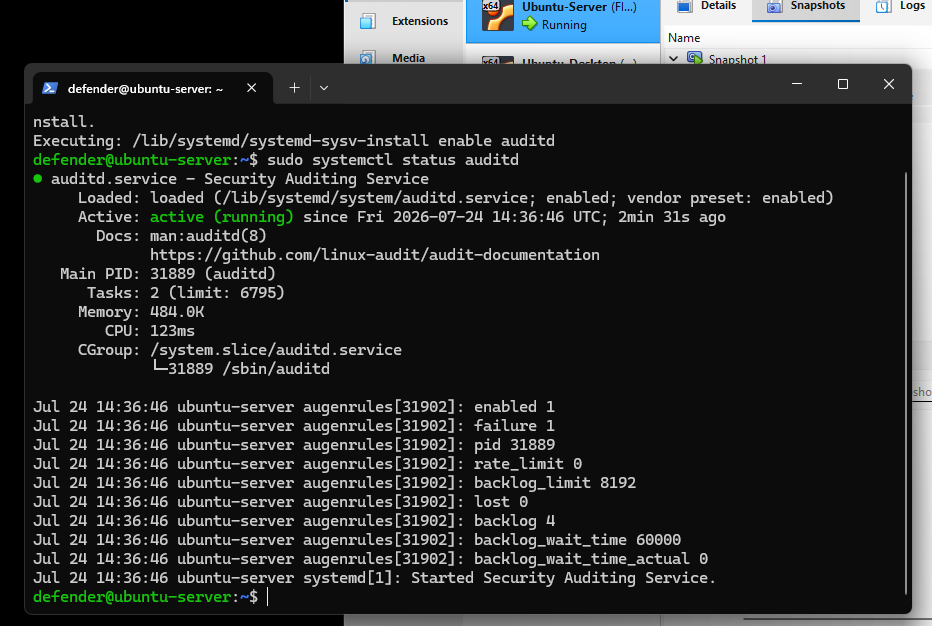
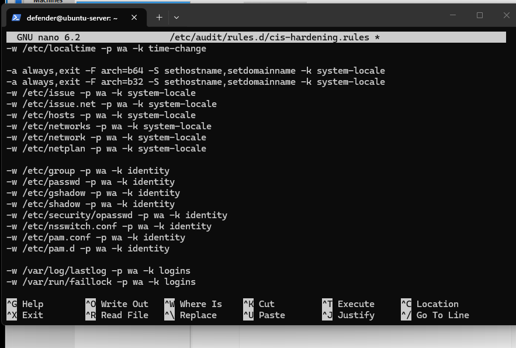
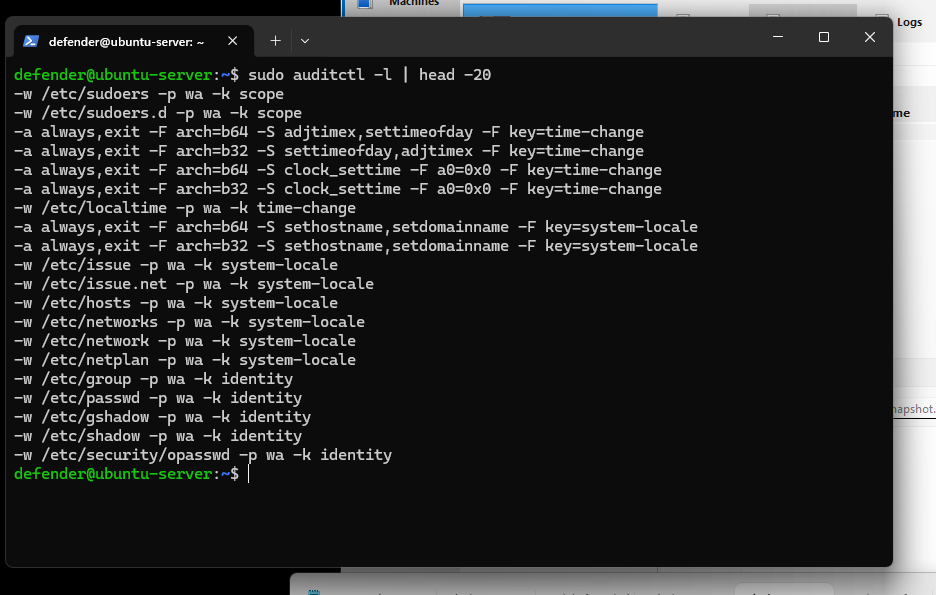
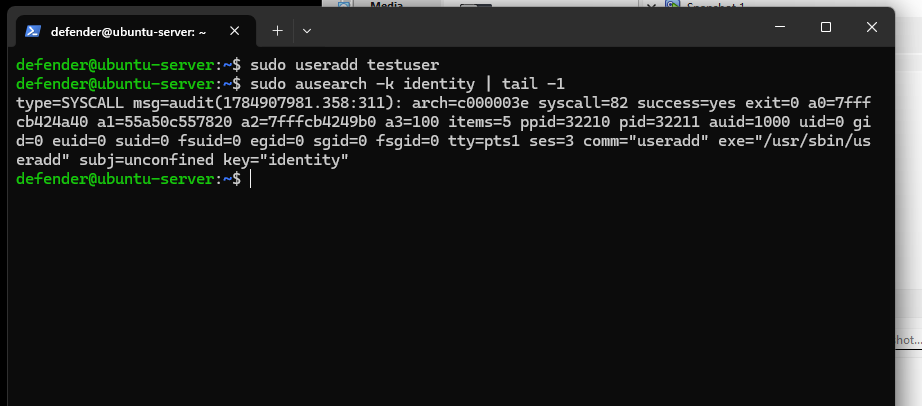

# Auditd Hardening (CIS Ubuntu 22.04 LTS Benchmark v3.0.0)
Auditd provides forensic‑grade logging for critical security events on the monitoring tower.  
This layer ensures visibility into privilege escalation, identity changes, time manipulation, and unauthorized system modifications.

---
## 1. Install and Enable Auditd
```
sudo apt install auditd
sudo systemctl start auditd
sudo systemctl enable auditd
sudo systemctl status auditd
```
Auditd is now active and will persist across reboots.



---
## 2. Create CIS‑Aligned Audit Rules
Create a new rules file:
```
sudo nano /etc/audit/rules.d/cis-hardening.rules
```
Paste the following rules.

---
## 3. Critical CIS Rules

### 3.1 Protect sudoers (Privilege Escalation Monitoring)
Attackers who compromise a low-privilege account often try to modify sudoers to escalate their access.
```
-w /etc/sudoers -p wa -k scope
-w /etc/sudoers.d/ -p wa -k scope
```

---
### 3.2 Detect System Time Manipulation
Attackers commonly alter system time to obscure or misalign timestamps in logs during an intrusion.
```
-a always,exit -F arch=b64 -S adjtimex,settimeofday -k time-change
-a always,exit -F arch=b32 -S adjtimex,settimeofday -k time-change
-a always,exit -F arch=b64 -S clock_settime -F a0=0x0 -k time-change
-a always,exit -F arch=b32 -S clock_settime -F a0=0x0 -k time-change
-w /etc/localtime -p wa -k time-change
```

---
### 3.3 Monitor System Locale and Hostname Changes
```
-a always,exit -F arch=b64 -S sethostname,setdomainname -k system-locale
-a always,exit -F arch=b32 -S sethostname,setdomainname -k system-locale
-w /etc/issue -p wa -k system-locale
-w /etc/issue.net -p wa -k system-locale
-w /etc/hosts -p wa -k system-locale
-w /etc/networks -p wa -k system-locale
-w /etc/network/ -p wa -k system-locale
-w /etc/netplan/ -p wa -k system-locale
```

---
### 3.4 Identity Management (User/Group Changes)
This is the most critical section — these files control every account and permission boundary on the system.
```
-w /etc/group -p wa -k identity
-w /etc/passwd -p wa -k identity
-w /etc/gshadow -p wa -k identity
-w /etc/shadow -p wa -k identity
-w /etc/security/opasswd -p wa -k identity
```



---
### 3.5 Login/Logout Tracking
Essential for detecting brute-force attempts and unauthorized access.
```
-w /var/log/lastlog -p wa -k logins
-w /var/run/faillock -p wa -k logins
```

---
## 4. Load Rules Into the Kernel
```
sudo augenrules --load
```

---
## 5. Verify Loaded Rules
```
sudo auditctl -l | head -20
```
This confirms the kernel is enforcing your CIS rules.



---
## 6. Test Identity Tracking
Create a test user:
```
sudo useradd testuser
```
Search audit logs for identity events:
```
sudo ausearch -k identity | tail -1
```
You should see an event showing the creation of `testuser`.



---
## 7. Generate a Summary Report
```
sudo aureport --summary
```
This provides an overview of all audit activity on the system.

---
## 8. Hardening Summary
Auditd is now configured with:
- CIS‑aligned monitoring  
- Privilege escalation detection  
- Identity management logging  
- Time manipulation alerts  
- Network configuration monitoring  
- Login/logout tracking  

This forms the forensic logging foundation of your monitoring tower.
