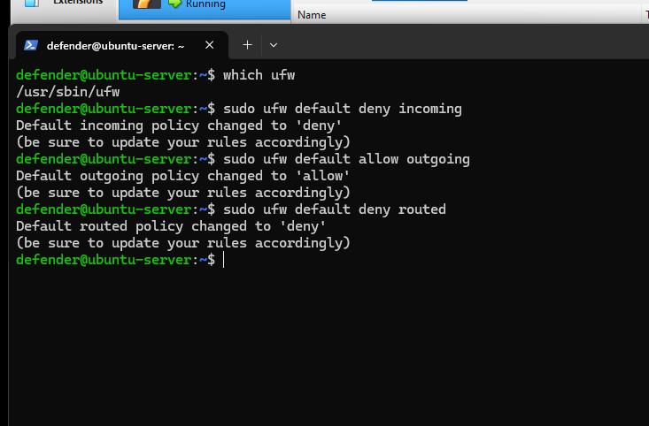
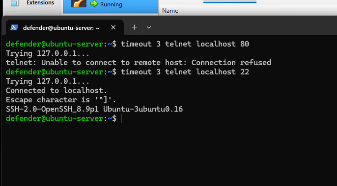

# UFW Firewall Hardening (CIS Ubuntu 22.04 LTS Benchmark v3.0.0)
The monitoring tower must enforce strict host‑level firewall controls.  
UFW provides a simple but powerful interface for implementing CIS‑aligned firewall rules.
This layer ensures a secure default‑deny posture, controlled SSH access, and defense‑in‑depth.

---
## 1. Apply CIS Secure Default Posture
Block all incoming traffic by default:
```
sudo ufw default deny incoming
```
Allow all outgoing traffic (normal system operations):
```
sudo ufw default allow outgoing
```
Deny routed traffic (this server is not acting as a router):
```
sudo ufw default deny routed
```
Since this server isn't functioning as a router or gateway for other devices, it should never forward traffic between interfaces. Disabling this closes a potential pivot path an attacker could abuse if the box were ever compromised.



---
## 2. Allow SSH Before Enabling the Firewall
To avoid locking yourself out:
```
sudo ufw allow 22/tcp comment 'SSH'
```
Verify the rule was added:
```
sudo ufw show added
```

---
## 3. Enable UFW
```
sudo ufw enable
```
Check status:
```
sudo ufw status verbose
```
You should see:
- Default deny incoming  
- Default allow outgoing  
- SSH allowed  
- Logging enabled  

---
## 4. Test Firewall Behavior
### Test blocked ports (should fail):
```
timeout 3 telnet localhost 80
```
### Test allowed SSH port (should succeed):
```
timeout 3 telnet localhost 22
```
These tests confirm UFW is enforcing your rules correctly.



---
## 5. Hardening Summary
UFW is now configured with:
- CIS default‑deny posture  
- Controlled SSH access  
- Routed traffic disabled  
- Verified firewall behavior  

UFW enforces static allow/deny rules at the network layer; Fail2Ban (see `fail2ban-hardening.md`) adds dynamic, behavior-based bans on top of this baseline, together forming a layered defense.

This forms the host‑level defense‑in‑depth layer for your monitoring tower.
