# Active Directory Lab Build

Active Directory (AD) serves as the centralized identity and access management backbone for enterprise Windows networks worldwide. Because AD controls authentication, authorization, and domain policies, it is a primary target for threat actors — gaining full control over AD effectively grants complete domain dominance.

This project documents the step-by-step deployment of an Active Directory domain environment, covering domain controller installation, network configuration, client endpoint domain join, user provisioning, and command-line authentication verification.

---

## Technical Overview & Prerequisites

* **Domain Controller (`DC01`):** Windows Server 2019 Standard Evaluation (GUI)
* **Domain Name:** `cdmdc.local` (NetBIOS: `CDMDC`)
* **Static IP Address:** `192.168.56.10`
* **Network Gateway:** pfSense Virtual Firewall
* **Client Workstation (`WIN10-CLI01`):** Windows 10 Enterprise
* **Core Protocols:** Kerberos, NTLM, DNS, LDAP

---

## Deployment Lifecycle

1. **Infrastructure Setup:** Deploy Windows Server 2019 and configure static IP addressing.
2. **AD DS Deployment:** Install Active Directory Domain Services and promote the server to the Forest Root Domain Controller.
3. **Endpoint Integration:** Configure client DNS to point to `DC01` and perform a domain join on the Windows 10 host.
4. **User Provisioning:** Create standard domain user accounts using Active Directory Users and Computers (ADUC).
5. **Authentication & Validation:** Verify Kerberos ticket issuance, client domain connectivity, and AD database attributes via PowerShell and CLI tools.

---

## Step-by-Step Implementation

### Phase 1: Virtual Machine Provisioning & Network Configuration

1. **VM Setup:** Created a new virtual machine in VirtualBox using the **Windows Server 2019 Standard Evaluation** ISO.

   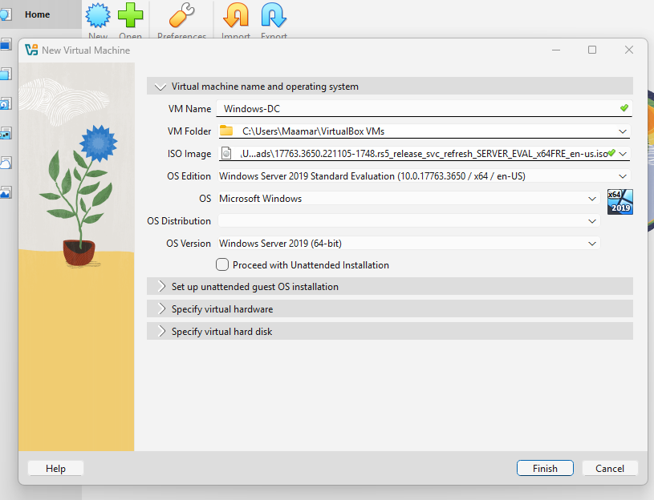

   > **Note:** During VM creation, ensure **Unattended Installation** is disabled to retain manual control over partition layout, component selection, and setup configuration.

2. **Post-Installation Maintenance:** Unmounted the Windows Server ISO from the virtual optical drive prior to reboot to prevent an installation boot loop, then renamed the server to `DC01` to reflect its intended role.

3. **Static Network Allocation:** Configured `DC01` with a fixed IP address (`192.168.56.10`) on a VirtualBox Host-Only adapter. Domain Controllers require persistent static IP addressing so network endpoints can reliably locate authentication services and resolve SRV records.

   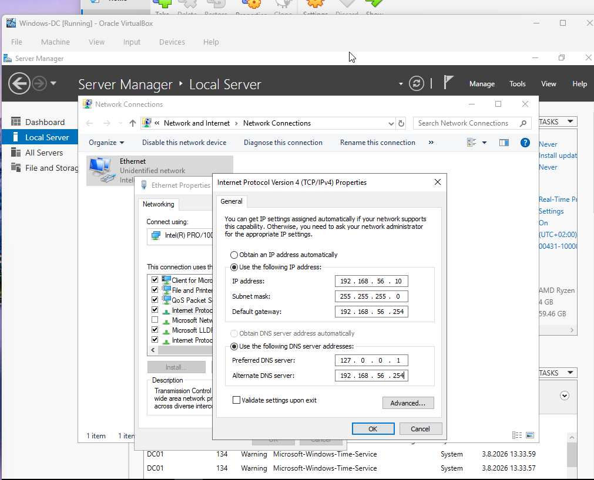

4. **Connectivity Verification:** Confirmed IP assignment and tested gateway/internet reachability before proceeding to AD DS installation.

   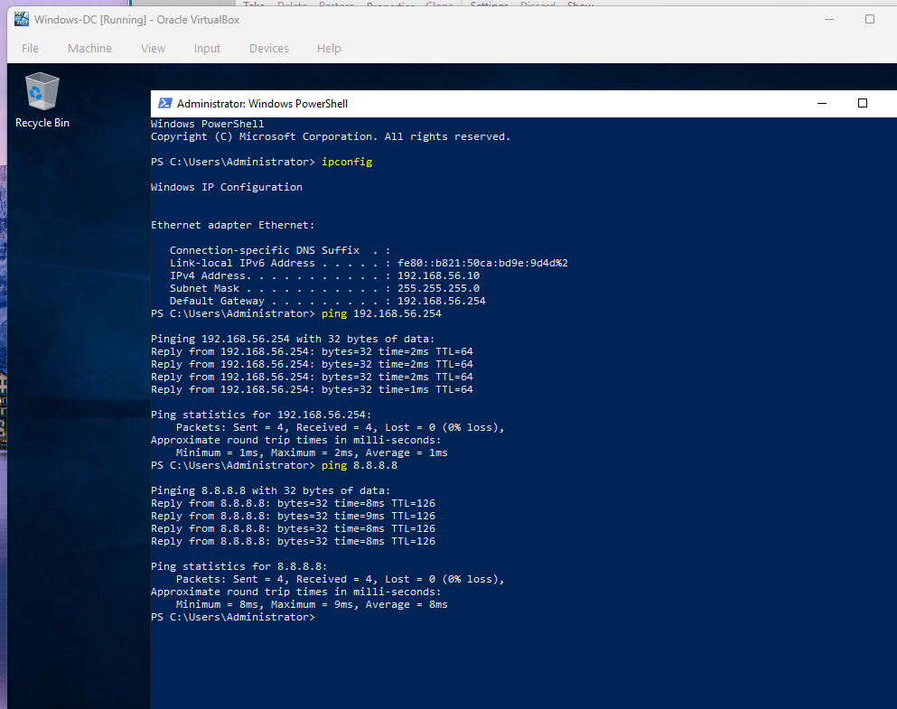

---

### Phase 2: Promoting DC01 to Forest Root Domain Controller

1. Installed the **Active Directory Domain Services (AD DS)** role, along with **DNS Server**, via Server Manager.

   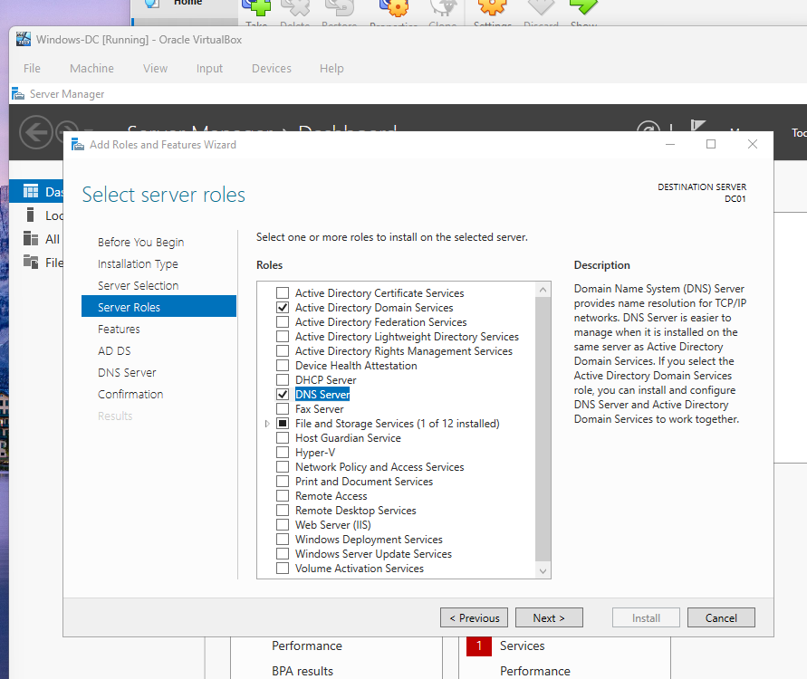

2. Promoted the server to a Domain Controller, establishing a new forest named **`cdmdc.local`**, setting the forest/domain functional level, and configuring the DSRM (Directory Services Restore Mode) password.

   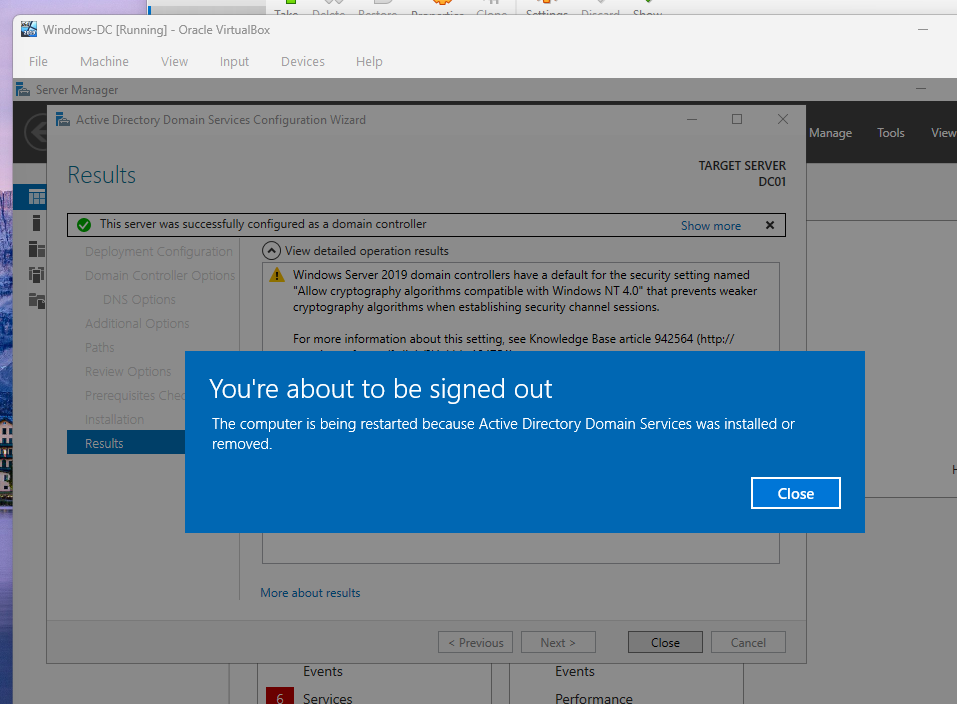

3. Verified core AD DS services (`NTDS`, `DNS`, `KDC`, `Netlogon`) were fully operational following the post-promotion reboot, including the `cdmdc.local` Active Directory-integrated DNS zone.

   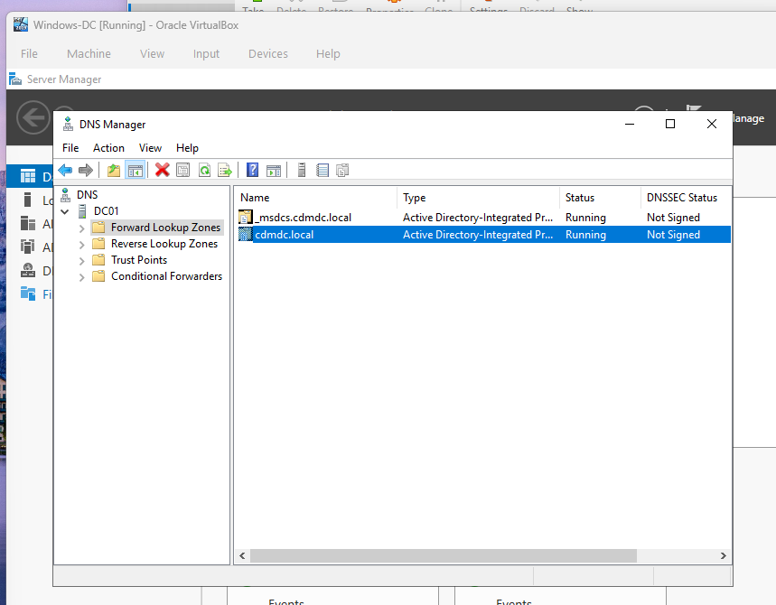

---

### Phase 3: Client Integration & User Provisioning

1. Configured the Windows 10 client host's primary DNS to point directly to `DC01` (`192.168.56.10`).

2. Successfully joined `WIN10-CLI01` to the `cdmdc.local` domain.

   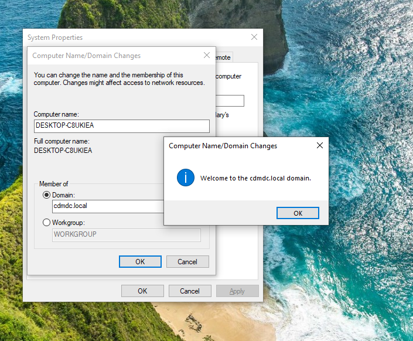

3. Opened **Active Directory Users and Computers (ADUC)** on `DC01` and provisioned a standard domain user:
   * **Full Name:** John Doe
   * **Logon Name:** `jdoe` (`jdoe@cdmdc.local`)

   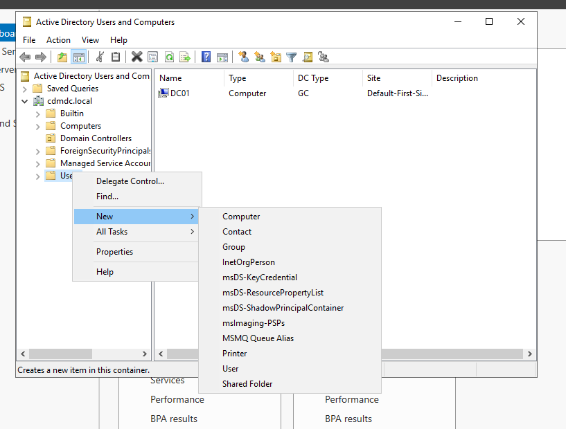

4. Performed the first interactive domain logon on the client as `jdoe`, confirming end-to-end authentication and profile creation.

   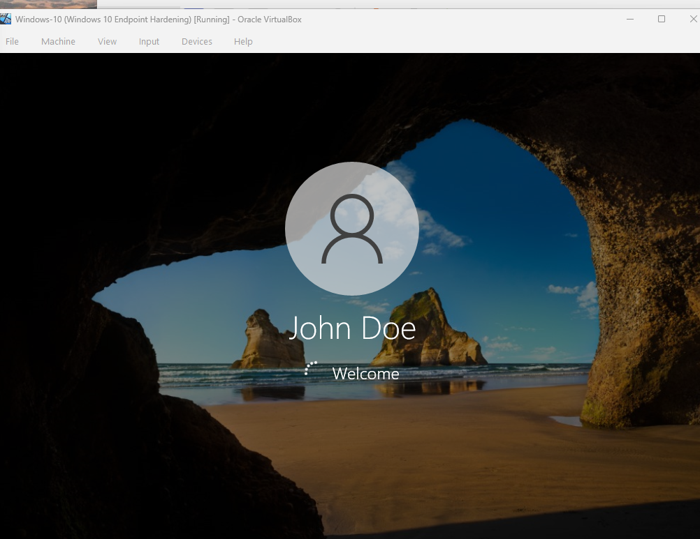

---

## Validation & Verification

### 1. Client Domain Controller Discovery (`WIN10-CLI01`)

Executed `nltest` on the Windows 10 client workstation to verify DC locator services, site binding, and secure channel communication with `DC01`.

```powershell
nltest /dsgetdc:cdmdc.local
```

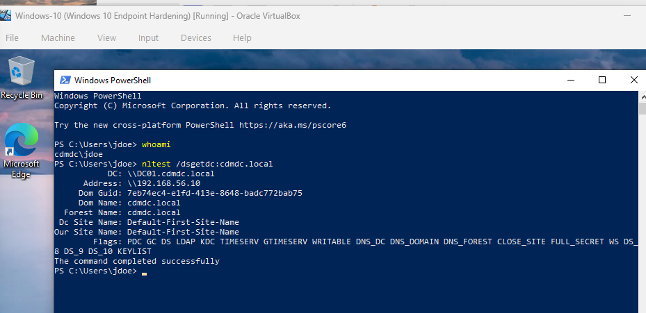

*Figure 1: `nltest` output confirming DC discovery and secure channel status with `DC01`.*

### 2. Domain Identity Query (`DC01`)

Ran the Active Directory PowerShell module on `DC01` to query the domain database and inspect account properties for the newly provisioned user object.

```powershell
Get-ADUser -Identity jdoe
```

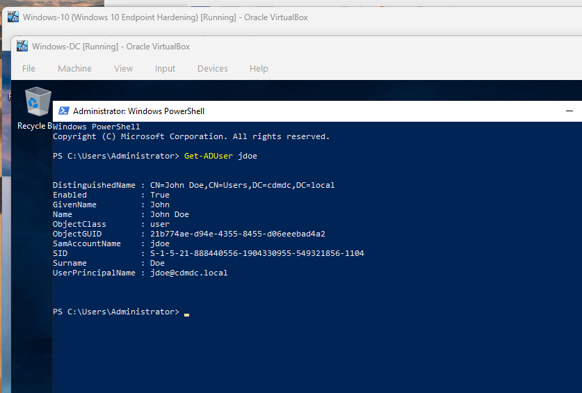

*Figure 2: PowerShell output displaying DistinguishedName (DN), SID, and account status for user `jdoe`.*

### 3. Active Directory Computer Objects Query (`DC01`)

Ran `Get-ADComputer` to verify that both the Domain Controller (`DC01`) and the Windows 10 workstation (`DESKTOP-C8UKIEA`) are successfully registered as active machine accounts in the AD database.

```powershell
Get-ADComputer -Filter *
```

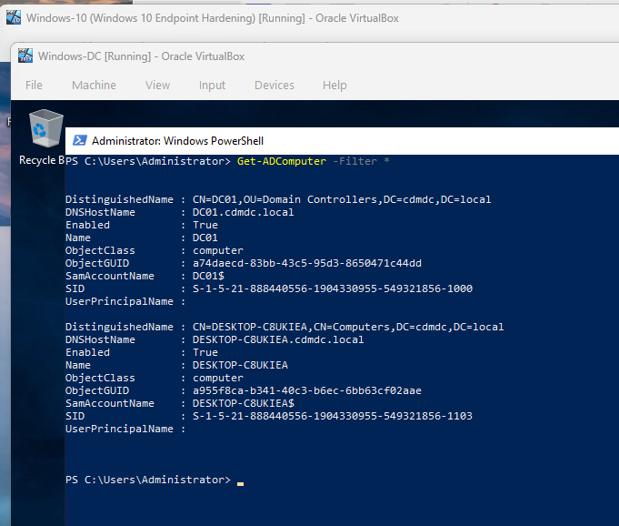

*Figure 3: PowerShell output displaying DistinguishedName (DN), SAMAccountName, and SID attributes for all domain-joined computer objects.*

---

## SOC Analyst Takeaways

* **Kerberos & NTLM Traffic:** This lab setup allows for capturing authentication traffic (AS-REQ / AS-REP exchanges) via Wireshark to observe how Kerberos issues Ticket Granting Tickets (TGTs) versus legacy NTLM fallback behavior.
* **Event Log Monitoring:** Successful logins, domain joins, and user provisioning events can be analyzed directly in Windows Event Viewer (e.g., Event IDs 4624, 4720, 4768) to build detection rules for threat hunting.
