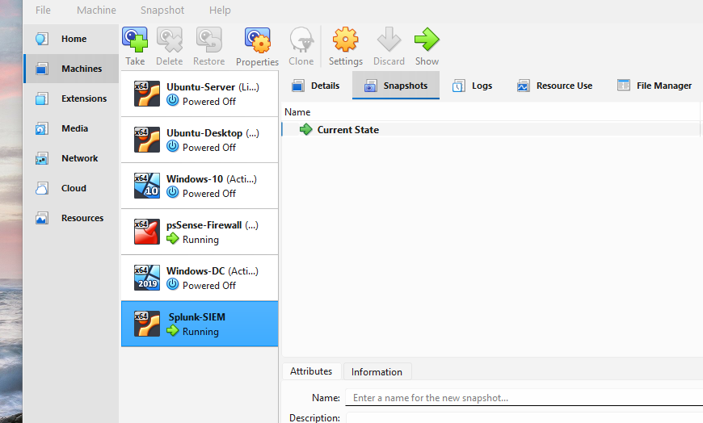
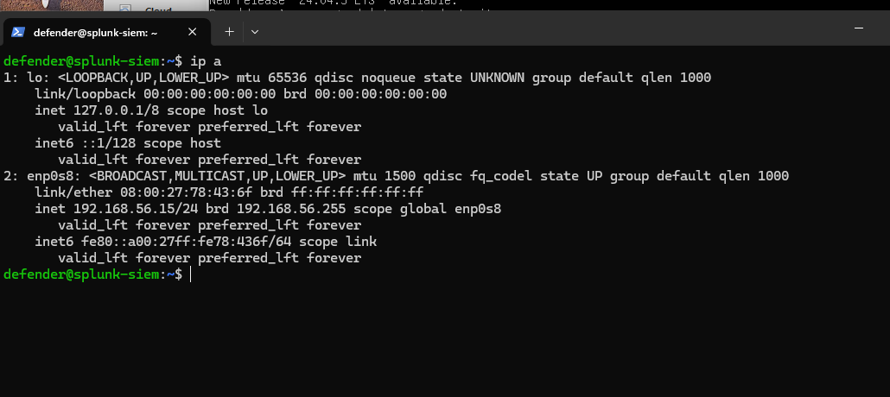
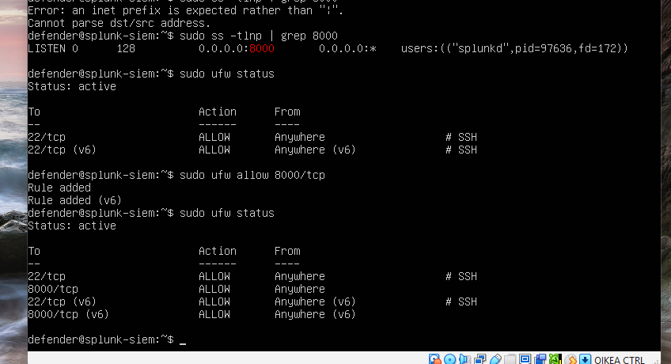
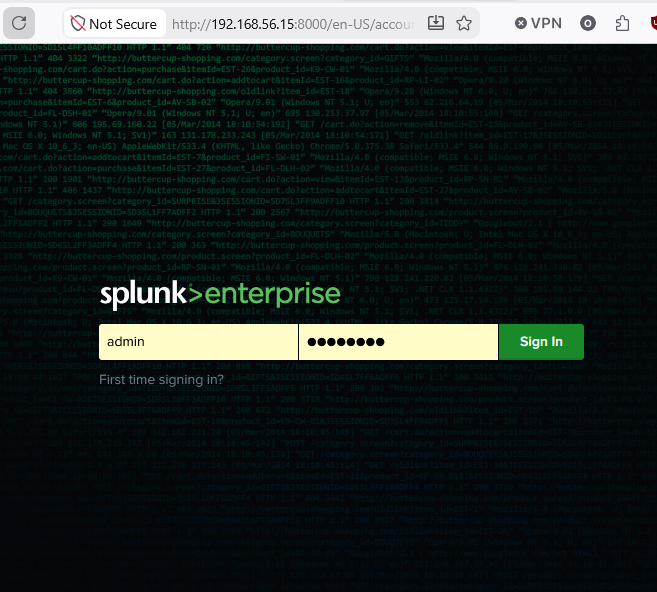
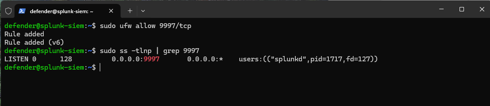
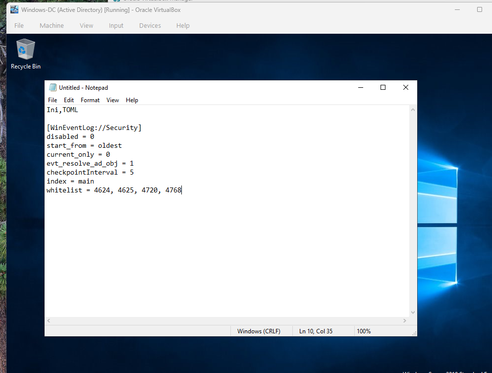
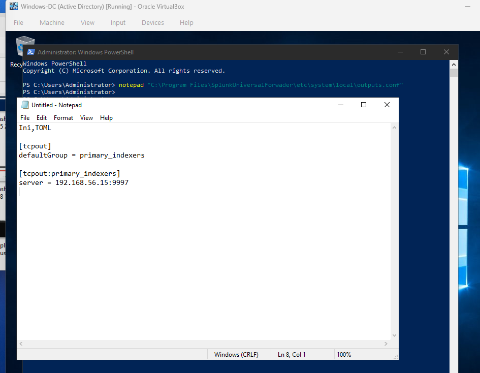
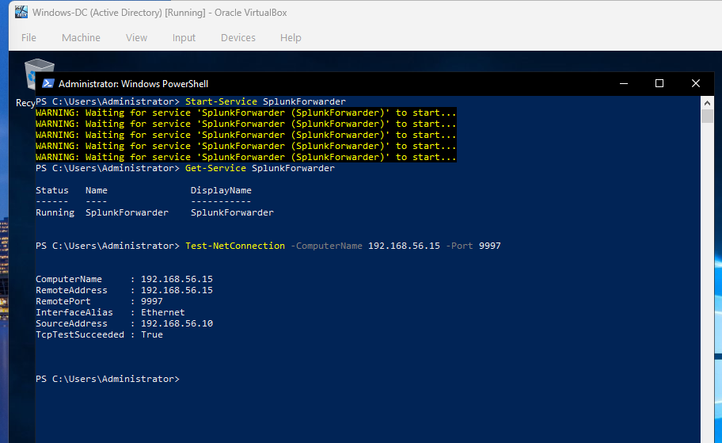
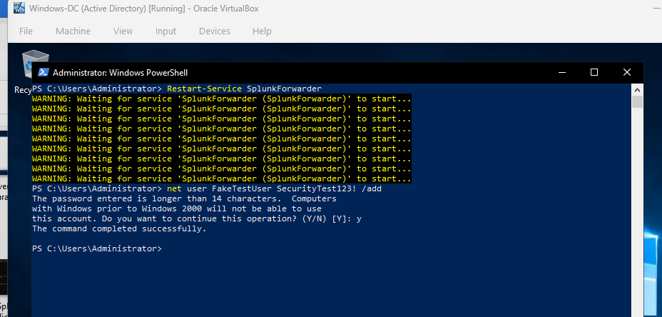
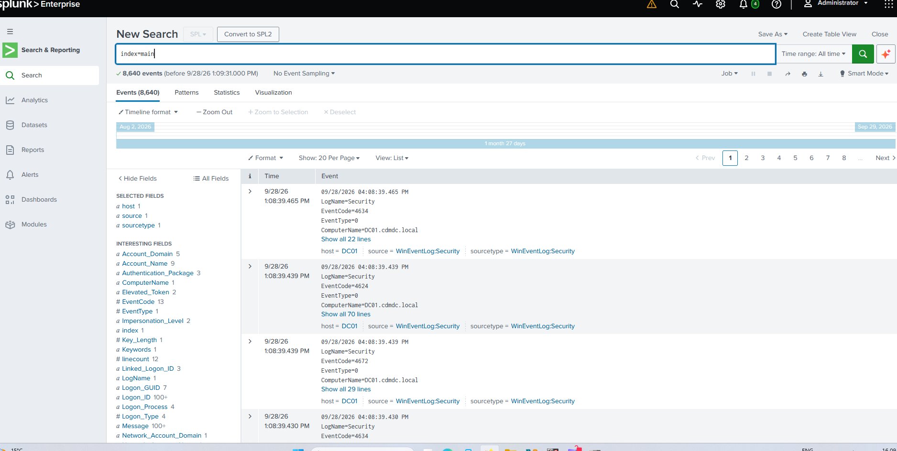

# Splunk SIEM Deployment & Detection Engineering

Splunk Enterprise is one of the most widely used SIEM platforms in the SOC/security analyst job market, making it a core skill for identity- and log-based threat detection. This lab documents the deployment of a dedicated Splunk Enterprise instance as the central log aggregation and search platform for the home lab, then connects the Active Directory environment built in `06-active-directory-lab` to it and builds detection searches on top of the ingested identity events.

The project covers VM provisioning, static network configuration (including a real cloud-init persistence issue encountered and resolved), Splunk installation, firewall configuration, Universal Forwarder deployment on the Domain Controller, attack simulation, and SPL detection engineering.

---

## Technical Overview & Prerequisites

* **SIEM Host (`Splunk-SIEM`):** Ubuntu Server 22.04, cloned from the existing `Ubuntu-Server` base image
* **Static IP Address:** `192.168.56.15` (deliberately placed outside pfSense's DHCP pool of `192.168.56.100`–`192.168.56.200`)
* **Gateway:** `192.168.56.254` (pfSense)
* **DNS:** `192.168.56.10` (DC01) with `8.8.8.8` as fallback
* **Splunk Version:** Splunk Enterprise 10.4.3 (Linux `.deb` package)
* **Web Interface:** `8000/tcp`
* **Forwarder Receiver Port:** `9997/tcp`
* **Log Source:** Domain Controller `DC01` (`192.168.56.10`) running the Splunk Universal Forwarder

---

## Deployment Lifecycle

1. **VM Provisioning:** Clone the existing Ubuntu-Server VM to create a dedicated Splunk host, avoiding a full OS reinstall.
2. **Network Configuration:** Assign a static IP outside the DHCP pool, and resolve a cloud-init persistence issue that silently reverted the config on reboot.
3. **Splunk Installation:** Transfer and install the Splunk Enterprise `.deb` package, start the service, and create the admin account.
4. **Firewall Configuration:** Open the Splunk Web port through UFW, which was blocking access by default.
5. **Log Pipeline:** Enable the forwarder receiver, deploy the Universal Forwarder on `DC01`, and restrict ingestion to high-value authentication events.
6. **Threat Simulation:** Trigger a real Active Directory account creation event and confirm it reaches Splunk.
7. **Detection Engineering:** Build SPL searches for account creation, brute force, and Kerberos activity.

---

## Step-by-Step Implementation

### Phase 1: VM Provisioning & Network Configuration

1. **Cloning:** Right-clicked the existing `Ubuntu-Server` VM in VirtualBox → **Clone** → selected **Current Machine State** and **Full Clone**, with **Generate new MAC addresses** enabled to avoid network conflicts with the original VM. Named the result `Splunk-SIEM`.

   

2. **Hostname:** Set the hostname to `splunk-siem` via `hostnamectl` to distinguish it clearly from the original Ubuntu-Server box in logs and SSH sessions.

3. **Static IP Assignment:** Initially attempted a static IP via Netplan, but the address kept reverting to a DHCP-assigned `192.168.56.101` after reboot. Root cause: **cloud-init regenerates `/etc/netplan/50-cloud-init.yaml` on every boot**, silently overwriting manual edits to that file.

   **Fix applied:**
   - Disabled cloud-init's network management via `/etc/cloud/cloud.cfg.d/99-disable-network-config.cfg` (`network: {config: disabled}`)
   - Created a separate, higher-priority netplan file (`99-static.yaml`) that cloud-init does not touch
   - Removed the conflicting `50-cloud-init.yaml`

   The final static configuration:
   ```yaml
   network:
     version: 2
     ethernets:
       enp0s8:
         dhcp4: no
         addresses:
           - 192.168.56.15/24
         routes:
           - to: default
             via: 192.168.56.254
         nameservers:
           addresses:
             - 192.168.56.10
             - 8.8.8.8
   ```

   

---

### Phase 2: Splunk Enterprise Installation

1. Downloaded the Splunk Enterprise 10.4.3 Linux `.deb` package and transferred it to the VM via `scp` over SSH.
2. Installed the package with `dpkg -i`.
3. Reassigned ownership of `/opt/splunk` to a non-root user, since running Splunk as root is deprecated.
4. Started Splunk with `splunk start --accept-license`, creating the initial `admin` account.
5. Enabled Splunk to auto-start on boot with `splunk enable boot-start`.

---

### Phase 3: Firewall Configuration

By default, `ufw` on the VM only allowed inbound SSH (port 22), which silently blocked all browser connections to Splunk Web on port 8000. Splunk itself was running correctly (confirmed with `splunk status` and `ss -tlnp`), but the firewall was dropping the traffic before it reached the service.

```bash
sudo ufw allow 8000/tcp
```



Splunk Web then loaded correctly from the host browser at `http://192.168.56.15:8000`, and the `admin` login gave access to the home dashboard.




---

### Phase 4: Endpoint Integration & Log Pipeline Architecture

To establish end-to-end log aggregation from the Active Directory environment, a Splunk Universal Forwarder was deployed on Domain Controller `DC01` (`192.168.56.10`) and configured to stream targeted Security Event logs to the Splunk indexer (`192.168.56.15:9997`).

#### 1. Receiver Socket & Firewall Configuration

On the Splunk host, the forwarder receiving port was enabled, opened in UFW, and verified against the process socket bindings:

```bash
# Enable the forwarder receiving port
/opt/splunk/bin/splunk enable listen 9997

# Allow forwarder traffic through the host firewall
sudo ufw allow 9997/tcp

# Verify splunkd is bound to the receiver port
sudo ss -tlnp | grep 9997
```



#### 2. Ingestion Filtering (`inputs.conf`)

Rather than ingesting the noisy default event stream, a custom `inputs.conf` on `DC01` restricts collection to high-value identity and authentication events:

* **Event ID 4624:** Successful account logon
* **Event ID 4625:** Failed account logon
* **Event ID 4720:** A user account was created
* **Event ID 4768:** Kerberos authentication ticket (TGT) requested

```ini
[WinEventLog://Security]
disabled = 0
start_from = oldest
current_only = 0
evt_resolve_ad_obj = 1
whitelist = 4624,4625,4720,4768
```

`whitelist` limits ingestion to the four Event IDs above, `start_from = oldest` with `current_only = 0` also backfills existing historical events, and `evt_resolve_ad_obj = 1` resolves Active Directory object identifiers to readable names.



#### 3. Forwarder Target Routing (`outputs.conf`)

The Universal Forwarder was directed to send events to the Splunk receiver over TCP port 9997:

```ini
[tcpout]
defaultGroup = primary_indexers

[tcpout:primary_indexers]
server = 192.168.56.15:9997
```



#### 4. Forwarder Service & Connectivity Validation

Confirmed the forwarder service was running on `DC01` and that the indexer was reachable on the receiver port:

```powershell
Test-NetConnection -ComputerName 192.168.56.15 -Port 9997
```



---

### Phase 5: Threat Simulation & Pipeline Verification

To validate that the pipeline responds to suspicious endpoint activity, an Active Directory account creation was simulated directly on `DC01` from PowerShell. Creating a new account is a common persistence technique (MITRE ATT&CK T1136 – Create Account):

```powershell
net user FakeTestUser <TestPassword> /add
```



**Pipeline audit:** Over 8,600 events from host `DC01` were confirmed as ingested into Splunk Enterprise.



**Detection confirmed:** The simulated account creation appears in Splunk as Event ID 4720, surfaced by the first search below.


---

## Detection Engineering (SPL Queries)

With ingestion confirmed, the following Search Processing Language (SPL) queries were built for threat detection and SOC monitoring.

### 1. New User Account Created (Event ID 4720)

Identifies user account creation, extracting the new account name, the creator's identity, and the target host:

```spl
index=main EventCode=4720
| table _time, ComputerName, TargetUserName, SubjectUserName, Message
| sort -_time
```

### 2. Brute Force / Excessive Failed Logons (Event ID 4625)

Detects potential password spraying or brute force activity by flagging accounts, workstations, or source IPs with more than 5 failed logon attempts:

```spl
index=main EventCode=4625
| stats count by TargetUserName, WorkstationName, IpAddress
| where count > 5
| sort -count
```

### 3. Kerberos TGT Requests Summary (Event ID 4768)

Monitors Kerberos authentication requests across domain accounts to establish an authentication baseline:

```spl
index=main EventCode=4768
| stats count by TargetUserName, ServiceName, Status, IpAddress
| sort -count
```

### Detection Coverage

| Detection | Event ID | MITRE ATT&CK |
|---|---|---|
| New account created | 4720 | T1136 – Create Account |
| Excessive failed logons | 4625 | T1110 – Brute Force (incl. T1110.003 Password Spraying) |
| Kerberos TGT baseline | 4768 | T1558 – Steal or Forge Kerberos Tickets (baseline for anomaly detection) |

---

## Troubleshooting Notes

This deployment surfaced several real-world issues worth documenting, since they reflect practical SOC/sysadmin problem-solving rather than a clean happy-path install:

* **IP conflict avoidance:** Verified pfSense's DHCP pool range (`192.168.56.100`–`.200`) via the pfSense web GUI before assigning a static IP, to avoid future lease collisions.
* **Cloud-init network persistence bug:** Diagnosed why a correct static IP configuration reverted after reboot, and resolved it by disabling cloud-init's network management rather than repeatedly re-applying a config that would keep getting overwritten.
* **Firewall silently blocking a working service:** Used `splunk status` and `ss -tlnp` to confirm Splunk itself was healthy before isolating the problem to UFW. The same check applied again for the forwarder port (9997).

---

## SOC Analyst Takeaways

* **Centralized Authentication Visibility:** Domain Controller security events now flow into Splunk in near real time, so account creation, failed logons, and Kerberos activity can be searched from one place instead of logging into each host.
* **Targeted Ingestion:** Whitelisting four high-value Event IDs keeps noise and storage low, which matters on a lab with limited disk and mirrors how real teams control SIEM ingestion costs.
* **Validated, Not Assumed:** Detections were tested against a simulated attack rather than only written, which is the difference between a query that exists and a detection that works.

## Next Steps

* Forward `WIN10-CLI01` Windows logs and pfSense/Suricata logs into Splunk for cross-source correlation
* Convert the SPL searches into scheduled alerts
* Build a SOC dashboard summarizing authentication activity
