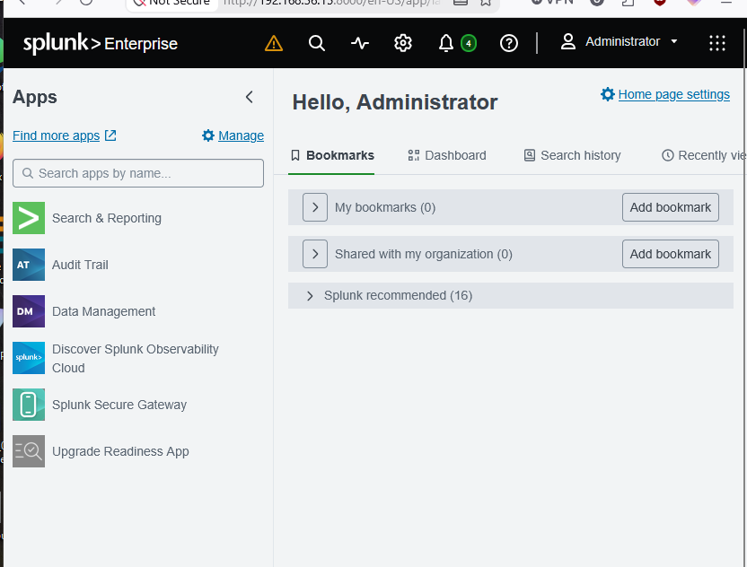

# Cyber-Defense-Lab-Portfolio


I'm building a hands-on Security Operations Center (SOC) home lab from scratch — not following a single tutorial, but designing, breaking, and fixing real infrastructure: Active Directory, a Splunk SIEM ingesting live authentication events, pfSense/Suricata network defense, and hardened Windows and Linux endpoints. Every lab below is documented with the actual commands run, the actual errors hit, and how they were resolved.

**Created by:** MaamarSec | **Status:** 🚧 In Progress | **Started:** April 2026
**Contact:** maamar[dot]sec[at]outlook[dot]com

---

## 🏆 Highlight: End-to-End Detection Pipeline

The strongest piece of this lab so far: a fully working detection pipeline, not just an install. A Splunk Enterprise SIEM ingests live Windows Security events from a real Active Directory Domain Controller, and a simulated attack (unauthorized account creation) was detected end-to-end using a custom SPL query — mapped to MITRE ATT&CK T1136.



👉 **[See the full Splunk SIEM build, including the attack simulation and detection queries](07-splunk-siem/)**

---

## 📊 Current Progress

| Folder | Topic | Status |
|---|---|---|
| [`00-lab-foundation/`](00-lab-foundation/) | Lab Foundation & Infrastructure Setup | ✅ Completed |
| [`01-monitoring-infrastructure/`](01-monitoring-infrastructure/) | Network Traffic Monitoring (TShark, Zeek, Suricata) | ✅ Completed |
| [`02-threat-detection/`](02-threat-detection/) | Network Monitoring & Threat Detection | ✅ Completed |
| [`03-network-protection-layer/`](03-network-protection-layer/) | Network Protection Layer (pfSense + Suricata IPS + pfBlockerNG) | ✅ Completed |
| [`04-endpoint-hardening/`](04-endpoint-hardening/) | Windows 10 Endpoint Hardening | ✅ Completed |
| [`05-linux-server-hardening/`](05-linux-server-hardening/) | Linux Server Hardening (UFW, Fail2Ban, auditd) | ✅ Completed |
| [`06-active-directory-lab/`](06-active-directory-lab/) | Active Directory Domain Deployment & Administration | ✅ Completed |
| [`07-splunk-siem/`](07-splunk-siem/) | Splunk SIEM Deployment & Detection Engineering (Universal Forwarder, SPL detections) | ✅ Completed |
| Upcoming | Threat Intel, Threat Hunting, IR, Forensics, Cloud Security, Purple Team | 🔜 Planned |

---

## 🏗️ Lab Architecture

**Infrastructure Components**
- Defense Platform: Ubuntu Server 22.04
- SIEM: Splunk Enterprise on a dedicated Ubuntu Server 22.04 VM
- Monitored Endpoints: Windows 10, Ubuntu Desktop
- Identity Infrastructure: Windows Server 2019 Active Directory Domain Controller (Splunk Universal Forwarder installed)
- Virtualization: VirtualBox
- Network Segmentation: NAT + Host-Only + Internal networks
- Firewall & IPS: pfSense + Suricata Inline IPS
- Threat Filtering: pfBlockerNG GeoIP + Reputation Lists

---

## 🚀 How to Explore This Repo

Each numbered folder is a self-contained lab with its own `README.md` covering: technical overview, step-by-step implementation, embedded screenshots, and a validation/detection section.

```bash
git clone https://github.com/MaamarSec/Cyber-Defense-Lab-Portfolio.git
cd Cyber-Defense-Lab-Portfolio
```

To follow the build in order, start with `00-lab-foundation/`, then proceed numerically. To jump straight to the most advanced work, start with [`07-splunk-siem/`](07-splunk-siem/).

---

## 🎯 Skills Progress

### ✅ Completed
- Virtual lab infrastructure setup, basic network configuration and segmentation
- Suricata installation, configuration, IDS/IPS testing
- Network threat detection fundamentals
- pfSense firewall rule design and pfBlockerNG Geo-blocking / IP reputation filtering
- Full VM routing through pfSense
- Windows 10 endpoint hardening
- Linux server hardening (UFW, Fail2Ban, auditd, SSH hardening)
- Active Directory Domain Services deployment & forest promotion
- Domain-joining Windows endpoints and provisioning domain user accounts
- Kerberos/NTLM authentication verification via PowerShell and CLI tools
- Splunk Enterprise deployment, static network configuration, and firewall setup
- Universal Forwarder deployment and Windows Security event ingestion filtering
- SPL detection searches for account creation, failed logons, and Kerberos activity mapped to MITRE ATT&CK
- Attack simulation to validate a detection end to end (account creation, Event ID 4720)

### 🔄 Currently Learning
- Splunk scheduled alerts and dashboards
- Forwarding endpoint and network logs (Windows 10, pfSense/Suricata) for cross-source correlation
- IDS/IPS tuning
- Network access control

### ⏳ Upcoming
- Threat intelligence integration
- Threat hunting methodology
- Incident response workflows
- Forensics and log analysis
- Cloud security fundamentals
- Purple team testing inside the lab

---

## 📂 Portfolio Structure

**Active**
- `00-lab-foundation/` — Core VM and network foundation for the lab
- `01-monitoring-infrastructure/` — Network traffic monitoring with TShark, Zeek, Suricata
- `02-threat-detection/` — Threat detection rules and analysis
- `03-network-protection-layer/` — pfSense, Suricata IPS, pfBlockerNG
- `04-endpoint-hardening/` — Windows 10 endpoint hardening
- `05-linux-server-hardening/` — Linux server hardening (UFW, Fail2Ban, auditd)
- `06-active-directory-lab/` — Active Directory domain deployment, client integration, and authentication validation
- `07-splunk-siem/` — Splunk SIEM deployment, log pipeline from the Domain Controller, and SPL detection engineering

**Planned**
- `08-threat-intelligence/`
- `09-threat-hunting/`
- `10-incident-response/`
- `11-forensics/`
- `12-edr-configurations/`
- `13-vulnerability-management/`
- `14-cloud-security/`
- `15-purple-team/`

---

## 🛠️ Technologies & Tools

**Currently Using**
- VirtualBox, Ubuntu Server 22.04, Windows 10, Windows Server 2019
- Wireshark, Zeek, Suricata, Nmap
- pfSense firewall, pfBlockerNG GeoIP filtering
- Active Directory Domain Services, DNS, Group Policy fundamentals
- Splunk Enterprise, Splunk Universal Forwarder, SPL
- MITRE ATT&CK for detection mapping

**Planned**
- Wazuh, ELK Stack
- Volatility, KAPE, OSQuery, MISP
- AWS logging & monitoring
- Atomic Red Team

---

## 📈 Goals

By the end of this project, I aim to have:
- A complete SOC-style home lab
- 20–30 custom detection rules
- A working SIEM with dashboards
- Hardened Windows & Linux endpoints
- A functioning Active Directory environment for identity-based detection scenarios
- Basic incident response playbooks
- Documented investigations and lab reports


---

## 📺 Learning Sources

This portfolio is based on:
- The Cyber Defense Mastery series by TechSky
- Additional blogs, documentation, and labs I explore independently

---

## ⚖️ Legal & Ethics

All security activities are carried out strictly within controlled lab environments on systems that I own. This project is dedicated solely to ethical and defensive cybersecurity practices.


## License

- **Code and configurations** (scripts, configs, automation): [MIT License](./LICENSE)
- **Documentation and screenshots** (READMEs, diagrams, write-ups): [CC BY 4.0](./LICENSE-docs)
