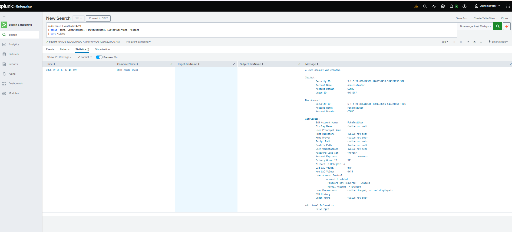

# Investigation 01: Unauthorized Account Creation on Domain Controller

**Status:** Resolved — Simulated Event (Lab Validation)
**Severity:** Medium (simulated; would be High in a production environment)
**Analyst:** MaamarSec
**Date:** September 28, 2026

---

## Alert Summary

| Field | Detail |
|---|---|
| **Detection Source** | Splunk Enterprise (SPL search against Windows Security Event Log) |
| **Event ID** | 4720 — A user account was created |
| **Host** | `DC01.cdmdc.local` (Active Directory Domain Controller) |
| **Timestamp** | 2026-09-28 13:07:48.369 |
| **New Account** | `FakeTestUser` (SID: `S-1-5-21-888440556-1904330955-549321856-1105`) |
| **Created By** | `CDMDC\Administrator` (SID: `S-1-5-21-888440556-1904330955-549321856-500`) |
| **MITRE ATT&CK** | [T1136 – Create Account](https://attack.mitre.org/techniques/T1136/) |

**Trigger:** The following SPL query, built during the detection engineering phase of [`07-splunk-siem`](../../07-splunk-siem/), surfaced the event:

```spl
index=main EventCode=4720
| table _time, ComputerName, TargetUserName, SubjectUserName, Message
| sort -_time
```



---

## Investigation Steps

1. **Identified the trigger.** The `New account creation` SPL search (one of three detections built in the Splunk lab) returned a result for an account named `FakeTestUser`, created at `2026-09-28 13:07:48` on `DC01`.

2. **Reviewed the full event body.** The raw Windows Security log entry (Event ID 4720) was pulled directly from Splunk rather than relying on the summarized table view, to confirm the subject and target account details:

   - **Subject (who created the account):** `CDMDC\Administrator`, SID `S-1-5-21-888440556-1904330955-549321856-500`, Logon ID `0x510C7`
   - **New account:** `FakeTestUser`, SID `S-1-5-21-888440556-1904330955-549321856-1105`, Account Domain `CDMDC`
   - **Account Control flags:** `Account Disabled`, `'Password Not Required' - Enabled`, `'Normal Account' - Enabled`

3. **Checked the creator's privilege level.** The Subject SID ends in RID `-500`, the well-known relative identifier for the built-in domain Administrator account, confirming this was created by a privileged identity rather than a standard user account that shouldn't have account-creation rights.

4. **Flagged a secondary finding.** Independent of the account's legitimacy, the `'Password Not Required'` UAC flag on the new account is a weak configuration in its own right — it would allow the account to be enabled later with no password requirement. This is worth noting as a finding even for an account ultimately confirmed as an authorized test.

5. **Correlated against expected activity.** Cross-referenced the event timestamp against the known lab activity log for that session, confirming this matched an intentional attack simulation performed to validate the detection pipeline, not an unexplained or unauthorized event.

---

## Timeline

| Time (UTC+3) | Event |
|---|---|
| 13:07:48.369 | `net user FakeTestUser <password> /add` executed on `DC01` by `CDMDC\Administrator` |
| ~13:08 | Splunk Universal Forwarder on `DC01` ships the Event ID 4720 log entry to the Splunk indexer (`192.168.56.15:9997`) |
| Same session | Analyst runs the Event ID 4720 SPL search in Splunk Web, confirming the event was ingested and searchable |

---

## Classification: Simulated Test Event (True Positive — Detection Validated)

This event was **intentionally generated** as part of validating the Splunk detection pipeline documented in [`07-splunk-siem`](../../07-splunk-siem/), not an actual unauthorized intrusion. It is classified as a **true positive** in the sense that matters for this exercise: the detection logic correctly identified and surfaced a real account-creation event, with accurate subject/target attribution, within one indexing cycle of the action occurring.

Being explicit about the simulated nature of this event is a deliberate choice — the goal of this write-up is to demonstrate investigative process and accurate classification, not to misrepresent a lab exercise as a real incident.

---

## Recommended Response (Production Scenario)

If this event occurred in a production environment rather than a lab, the following response would be appropriate:

1. **Verify against change management records.** Confirm whether the account creation was tied to an approved onboarding or administrative request.
2. **Review the account's purpose and owner.** An account created with no display name, no UPN, and no password requirement is inconsistent with a normal provisioning workflow and would warrant direct follow-up with the creating administrator.
3. **Remediate the weak UAC configuration.** Regardless of legitimacy, enforce a password requirement before the account is ever enabled.
4. **Expand monitoring.** Pair Event ID 4720 with Event ID 4722 (account enabled) and 4738 (account changed) to track the full lifecycle of newly created accounts, not just their creation.
5. **Escalate if unexplained.** If no change record exists and the creating admin cannot account for the action, treat as a potential compromised-credential scenario and escalate per incident response procedures.

---

## Supporting Detections

Two additional SPL searches from the same detection suite provide broader context around this account's subsequent activity, were it to log on:

```spl
# Failed logon attempts for this or other accounts
index=main EventCode=4625
| stats count by TargetUserName, WorkstationName, IpAddress
| where count > 5
| sort -count
```

```spl
# Kerberos authentication baseline
index=main EventCode=4768
| stats count by TargetUserName, ServiceName, Status, IpAddress
| sort -count
```

Full detection engineering detail, including how the log pipeline was built and validated, is documented in [`07-splunk-siem/README.md`](../../07-splunk-siem/README.md).
